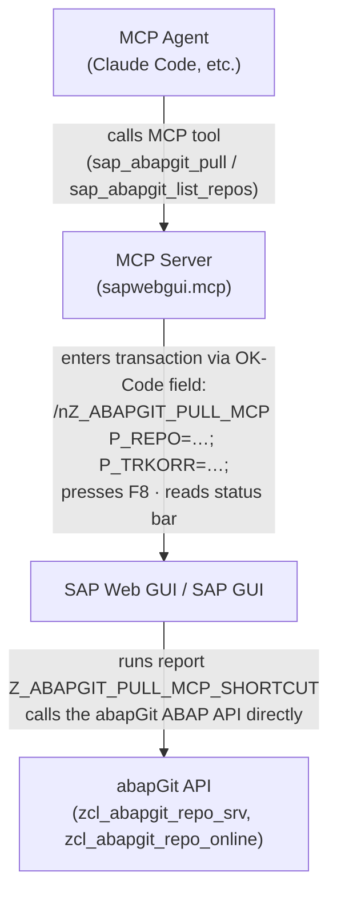

# Z_ABAPGIT_PULL_MCP_SHORTCUT

An ABAP report and transaction that wraps the [abapGit API](https://docs.abapgit.org/development-guide/api/api.html) so that MCP agents can pull code from Git and list repositories without navigating the abapGit UI.

[abapGit](https://docs.abapgit.org/user-guide/getting-started/install.html) must be installed in the SAP system.
Tested on R/3 and S/4.

## Names

| Object       | Name                          |
| ------------ | ----------------------------- |
| Package      | `Z_ABAPGIT_PULL_MCP_SHORTCUT` |
| Report       | `Z_ABAPGIT_PULL_MCP_SHORTCUT` |
| Transaction  | `Z_ABAPGIT_PULL_MCP`          |

The transaction code is shorter than the report name because SAP limits transaction codes to 20 characters.

## Why this exists

The abapGit UI is a complex multi-step web application. Automating it via browser (SAP WebGUI) or COM (SAP GUI for Windows) is fragile and slow. This report provides a simple, non-interactive entry point: fill parameters, press F8, read the status bar. That's exactly what an MCP tool needs.

## How it works

### Architecture



### Interaction via SAP WebGUI (browser automation)

The [sapwebgui.mcp](https://github.com/Hochfrequenz/sapwebgui.mcp) server uses Playwright to automate a browser session:

1. **Enter transaction with parameters** -- The server types the full parameterized command into the OK-Code field:
   ```
   /nZ_ABAPGIT_PULL_MCP P_REPO=MY_REPO; P_TRKORR=DEVK900123; P_USER=github-user; P_TOKEN=ghp_...;
   ```
   SAP opens the selection screen with all fields pre-filled.

2. **Execute** -- The server sends F8 (keyboard). The report runs non-interactively.

3. **Read result** -- For PULL: the server reads the SAP status bar (`MESSAGE s398` = success, `MESSAGE e398` = error). For LIST: the server reads the `WRITE` output from the HTML DOM.

### Interaction via SAP GUI for Windows (COM automation)

The [sapwebgui.mcp](https://github.com/Hochfrequenz/sapwebgui.mcp) server uses COM/win32com to control the SAP GUI desktop client:

1. **Enter transaction with parameters** -- Same OK-Code command, sent via the SAP GUI Scripting API:
   ```vb
   session.findById("wnd[0]/tbar[0]/okcd").text = "/nZ_ABAPGIT_PULL_MCP ..."
   session.findById("wnd[0]").sendVKey 0  ' Enter
   ```

2. **Execute** -- `sendVKey 8` (F8).

3. **Read result** -- `session.findById("wnd[0]/sbar").text` for the status bar message.

## Actions

### PULL (default)

Pulls (deserializes) a Git repository into SAP via the abapGit API.

**Parameters:**

| Parameter  | Required | Description                                      |
| ---------- | -------- | ------------------------------------------------ |
| `P_ACTION` | No       | `PULL` (default)                                  |
| `P_REPO`   | Yes      | Repository name as registered in abapGit          |
| `P_TRKORR` | If req.  | Transport request (required if system enforces it) |
| `P_USER`   | No       | GitHub username (for private repos)                |
| `P_TOKEN`  | No       | GitHub PAT (for private repos)                     |

**What it does:**

1. Finds the repository by name in abapGit's registry
2. Sets GitHub credentials if provided (for private repo authentication)
3. Runs `deserialize_checks()` to get required confirmations
4. Verifies the user has a modifiable task in the given transport
5. Auto-confirms all overwrite decisions (non-interactive mode)
6. Calls `lo_repo->deserialize()` to pull
7. Checks the deserialization log for errors
8. Reports success or error via `MESSAGE`

**Example OK-Code:**
```
/nZ_ABAPGIT_PULL_MCP P_REPO=MY_REPO; P_TRKORR=DEVK900123;
```

### LIST

Lists all registered abapGit repositories with metadata.

**Parameters:**

| Parameter  | Required | Description    |
| ---------- | -------- | -------------- |
| `P_ACTION` | Yes      | Must be `LIST` |

**Output format:** Tilde-delimited lines via `WRITE`, one per repository:
```
REPO_NAME~https://github.com/org/repo~$PACKAGE~refs/heads/main~20260225120000.0000000~DEVELOPER~
```

Fields: `name~url~package~branch~last_pull_at~last_pull_by~offline_flag`

The tilde (`~`) delimiter is used because SAP WebGUI strips pipe (`|`) characters from `WRITE` output.

The MCP server parses this output from the rendered HTML (WebGUI) or the GUI control tree (SAP GUI).

**Example OK-Code:**
```
/nZ_ABAPGIT_PULL_MCP P_ACTION=LIST;
```

## Installation

1. Clone this repository into your SAP system using abapGit
2. Create transaction `Z_ABAPGIT_PULL_MCP` in SE93:
   - Type: "Report transaction"
   - Program: `Z_ABAPGIT_PULL_MCP_SHORTCUT`
   - Screen: `1000`

## Used by

- [sapwebgui.mcp](https://github.com/Hochfrequenz/sapwebgui.mcp) -- MCP server for SAP GUI automation via Claude Code and other AI agents

## Related

- [AIBAP_TEMPLATE_REPOSITORY](https://github.com/Hochfrequenz/AIBAP_TEMPLATE_REPOSITORY) -- Describes the full vibe coding ABAP workflow: how to set up an ABAP repository for AI-assisted development using abapGit, MCP tools, and Claude Code end to end
