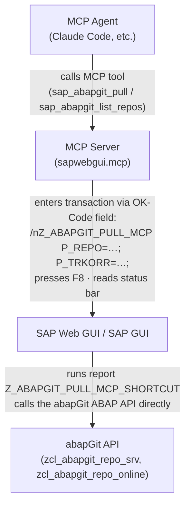

# Z_ABAPGIT_PULL_MCP_SHORTCUT

An ABAP report and transaction that wraps the [abapGit API](https://docs.abapgit.org/development-guide/api/api.html) so that MCP agents can pull code from Git and list repositories without navigating the abapGit UI.

[abapGit](https://docs.abapgit.org/user-guide/getting-started/install.html) must be installed in the SAP system.
Tested on R/3 and S/4.

## Names

| Object       | Name                          |
| ------------ | ----------------------------- |
| Package      | `Z_ABAPGIT_PULL_MCP_SHORTCUT` |
| Report       | `Z_ABAPGIT_PULL_MCP_SHORTCUT` |
| Transaction  | `Z_ABAPGIT_PULL_MCP`          |

The transaction code is shorter than the report name because SAP limits transaction codes to 20 characters.

## Why this exists

The abapGit UI is a complex multi-step web application. Automating it via browser (SAP WebGUI) or COM (SAP GUI for Windows) is fragile and slow. This report provides a simple, non-interactive entry point: fill parameters, press F8, read the status bar. That's exactly what an MCP tool needs.

## How it works

### Architecture


```mermaid
flowchart TD
    A["MCP Agent\n(Claude Code, etc.)"] -->|"calls MCP tool\n(sap_abapgit_pull / sap_abapgit_list_repos)"| B
    B["MCP Server\n(sapwebgui.mcp)"] -->|"enters transaction via OK-Code field:\n/nZ_ABAPGIT_PULL_MCP P_REPO=…; P_TRKORR=…;\npresses F8 · reads status bar"| C
    C["SAP Web GUI / SAP GUI"] -->|"runs report Z_ABAPGIT_PULL_MCP_SHORTCUT\ncalls the abapGit ABAP API directly"| D
    D["abapGit API\n(zcl_abapgit_repo_srv, zcl_abapgit_repo_online)"]
```

### Interaction via SAP WebGUI (browser automation)

The [sapwebgui.mcp](https://github.com/Hochfrequenz/sapwebgui.mcp) server uses Playwright to automate a browser session:

1. **Enter transaction with parameters** -- The server types the full parameterized command into the OK-Code field:
   ```
   /nZ_ABAPGIT_PULL_MCP P_REPO=MY_REPO; P_TRKORR=DEVK900123; P_USER=github-user; P_TOKEN=ghp_...;
   ```
   SAP opens the selection screen with all fields pre-filled.

2. **Execute** -- The server sends F8 (keyboard). The report runs non-interactively.

3. **Read result** -- For PULL: the server reads the SAP status bar (`MESSAGE s398` = success, `MESSAGE e398` = error). For LIST: the server reads the `WRITE` output from the HTML DOM.

### Interaction via SAP GUI for Windows (COM automation)

The [sapwebgui.mcp](https://github.com/Hochfrequenz/sapwebgui.mcp) server uses COM/win32com to control the SAP GUI desktop client:

1. **Enter transaction with parameters** -- Same OK-Code command, sent via the SAP GUI Scripting API:
   ```vb
   session.findById("wnd[0]/tbar[0]/okcd").text = "/nZ_ABAPGIT_PULL_MCP ..."
   session.findById("wnd[0]").sendVKey 0  ' Enter
   ```

2. **Execute** -- `sendVKey 8` (F8).

3. **Read result** -- `session.findById("wnd[0]/sbar").text` for the status bar message.

## Actions

### PULL (default)

Pulls (deserializes) a Git repository into SAP via the abapGit API.

**Parameters:**

| Parameter  | Required | Description                                      |
| ---------- | -------- | ------------------------------------------------ |
| `P_ACTION` | No       | `PULL` (default)                                  |
| `P_REPO`   | Yes      | Exact repository name or URL (case-insensitive)   |
| `P_TRKORR` | If req.  | Transport request (required if system enforces it) |
| `P_USER`   | No       | GitHub username (for private repos)                |
| `P_TOKEN`  | No       | GitHub PAT (for private repos)                     |

**What it does:**

1. Finds the repository by an **exact** match on its name or its URL
2. Sets GitHub credentials if provided (for private repo authentication)
3. Runs `deserialize_checks()` to get required confirmations
4. Verifies the user has a modifiable task in the given transport
5. Auto-confirms all overwrite decisions (non-interactive mode)
6. Calls `lo_repo->deserialize()` to pull
7. Checks the deserialization log for errors
8. Reports success or error via `MESSAGE`

`P_REPO` matches **exactly** — on the repository name, or on its URL. **Both
comparisons ignore case**, so there is no need to upper-case the input; the URL
comparison additionally normalises away a trailing slash and a `.git` suffix,
which the name comparison does not, because those characters are meaningful in a
name. It is not a substring match, and it deliberately refuses to guess: if
`P_REPO` matches more than one registered repository the report stops with

```
P_REPO is ambiguous: <value> matches <n>
```

rather than picking one. If it matches none:

```
Repository not found: <value> (exact name/URL, online only)
```

A consumer should tell those two apart — the first means "say which one", the
second means "check the name". Note PULL searches **online repositories only**,
so an offline repository reports "not found" rather than a more specific
message. That matters because step 5 below auto-confirms every
overwrite decision, so binding the wrong repository would silently deserialize
over an unrelated package and report success. A consumer should surface this
message as its own distinct failure, not as a generic error.

Matching the URL as well as the name is worth having because `get_name( )`
falls back to a URL-derived value whenever the stored name is blank, which it
commonly is.

**Example OK-Code:**
```
/nZ_ABAPGIT_PULL_MCP P_REPO=MY_REPO; P_TRKORR=DEVK900123;
```

### LIST

Lists all registered abapGit repositories with metadata.

**Parameters:**

| Parameter  | Required | Description    |
| ---------- | -------- | -------------- |
| `P_ACTION` | Yes      | Must be `LIST` |

**Output format:** Tilde-delimited lines via `WRITE`. The **first** line is a
header carrying the repository count; every following line is one repository:
```
TOTAL~53~~~~~
REPO_NAME~https://github.com/org/repo~$PACKAGE~refs/heads/main~20260225120000.0000000~DEVELOPER~
```

Fields: `name~url~package~branch~last_pull_at~last_pull_by~offline_flag`

The header is padded to the same seven fields, so a consumer that splits every
line blindly is unaffected; one that wants the count reads field 2 of the line
whose field 1 is `TOTAL`.

**Compare the header against the number of rows you actually parsed.** This is
a classic SAP list and it is paged: a consumer that reads only the visible page
gets a short answer with no indication that it is partial, and the visible page
is as tall as the SAP GUI window rather than a fixed number of rows. That is
why the count is a header and not a trailer — a trailing total lands on the
page such a consumer never reads, which is precisely the case it would exist to
detect. Lines are also cut at the window width, so read the full line width or
long rows come back with truncated trailing fields rather than missing ones.

If listing itself fails the report raises `MESSAGE e398` and writes no lines at
all, header included — so "no `TOTAL` line" means an error, not zero
repositories. Read the status bar in that case.

The tilde (`~`) delimiter is used because SAP WebGUI strips pipe (`|`) characters from `WRITE` output.

The MCP server parses this output from the rendered HTML (WebGUI) or the GUI control tree (SAP GUI).

**Example OK-Code:**
```
/nZ_ABAPGIT_PULL_MCP P_ACTION=LIST;
```

## ADT endpoints for aibap.mcp

The package also contains three custom ADT REST resources, so that
[aibap.mcp](https://github.com/Hochfrequenz/aibap.mcp) can list, pull and push
abapGit repositories over plain HTTP, without SAP GUI. They back the MCP tools
`abapgit_list_repos`, `abapgit_pull` and `abapgit_push`. The contract (JSON
bodies, error codes, guard rules) is the design spec on
[aibap.mcp#135](https://github.com/Hochfrequenz/aibap.mcp/issues/135).

| Method | Path                              | Purpose                                 |
| ------ | --------------------------------- | --------------------------------------- |
| GET    | `/sap/bc/adt/abapgitsync/repos`   | List the registered repositories        |
| POST   | `/sap/bc/adt/abapgitsync/pull`    | Pull, with confirmation of local work   |
| POST   | `/sap/bc/adt/abapgitsync/push`    | Push the files of named objects         |

The path lies outside `/sap/bc/adt/abapgit/`, because the deprecated
[abapGit ADT_Backend](https://github.com/abapGit/ADT_Backend) registers that
pattern. Registration is the enhancement implementation `ZABAPGIT_MCP_SYNC_ADT`
of `BADI_ADT_REST_RFC_APPLICATION` plus a discovery provider.

| Object                     | Role                                                         |
| -------------------------- | ------------------------------------------------------------ |
| `ZCL_ABAPGIT_MCP_SYNC`     | Logic: repository matching, list, pull, push                 |
| `ZCL_ABAPGIT_MCP_GUARD`    | Pure guard rules for pull and push (ABAP Unit)               |
| `ZCL_ABAPGIT_MCP_GIT_AUTH` | Credential preflight against the Git host                    |
| `ZCX_ABAPGIT_MCP_SYNC`     | Error with contract code and HTTP status                     |
| `ZCL_ABAPGIT_MCP_JSON`     | JSON bodies through the Simple Transformations `ZABAPGIT_MCP_*` |
| `ZCL_ABAPGIT_MCP_ADT_*`    | ADT application and the three resources                      |
| `ZIF_ABAPGIT_MCP_SYNC`     | Contract types and constants                                 |

The report uses the same repository matching (`ZCL_ABAPGIT_MCP_SYNC=>find_online_repos`)
and otherwise behaves as described above. The endpoints differ from the report
in two ways on purpose: a pull that would touch local work answers
`needs_confirmation` instead of overwriting, and a confirmed pull deletes
objects that were deleted in Git, in the same order as the abapGit UI
(delete, refresh, deserialize). The report never deletes.

### Git credentials: the `ZGIT_<SAP user>` destination

A push always needs credentials; a pull of a private repository does too.
Credentials never pass through aibap.mcp. Each SAP user creates their own SM59
HTTP destination:

1. SM59 → Create → type **G** (HTTP connection to external server)
2. Name: `ZGIT_` followed by the SAP user name, e.g. `ZGIT_DEVELOPER`
3. Technical settings: host `github.com`, port `443`
4. Logon & Security: **SSL active** (SSL client `ANONYM` or the client your
   Basis team uses for GitHub), **basic authentication** with your GitHub user
   name and a **fine-grained personal access token** as password, limited to
   the repositories you push to, permission "Contents: read and write"
5. Save, then run "Connection Test": any HTTP answer from github.com shows that
   host, port and SSL are set up; the credentials are checked on the first pull
   or push

Creating a destination needs SM59 authorisation (`S_RFC_ADM`). A user without it
asks their Basis team.

Leave the destination's path prefix empty: the companion appends the repository
path itself. If your system reaches github.com only through a proxy, enter it
in the destination too; abapGit's own proxy settings apply to abapGit's
requests, not to the credential preflight that runs through the destination.

**The protection is weak.** The password sits in SAP's secure store and cannot
be read back in clear, but the destination itself can be used by others:
without an authorisation group any user can send requests through it; with a
group, every user holding `S_ICF` for that group can, which includes the
`S_ICF *` that is common on development systems; and anyone who can run
arbitrary ABAP can open `ZGIT_<your user>` directly. Use a fine-grained token
limited to the repositories it is needed for, and nothing broader.

Before abapGit talks to the Git host, the companion sends
`GET <repo>/info/refs?service=git-upload-pack` (pull) or `git-receive-pack`
(push) itself, so a missing or rejected credential comes back as
`CREDENTIALS_MISSING` or `CREDENTIALS_REJECTED` instead of an abapGit
exception. A pull of a public repository needs no destination.

## Installation

Prerequisites: SAP_BASIS 750 or higher, and the abapGit **developer version**
(not the standalone report) 1.128.0 or higher.

1. Clone this repository into your SAP system using abapGit
2. Create transaction `Z_ABAPGIT_PULL_MCP` in SE93:
   - Type: "Report transaction"
   - Program: `Z_ABAPGIT_PULL_MCP_SHORTCUT`
   - Screen: `1000`
3. abapGit does not deploy class test includes (`*.clas.testclasses.abap`, see
   [#5](https://github.com/Hochfrequenz/Z_ABAPGIT_PULL_MCP_SHORTCUT/issues/5)).
   To run the ABAP Unit tests, create them from the files in `src/`.

## Used by

- [sapwebgui.mcp](https://github.com/Hochfrequenz/sapwebgui.mcp) -- MCP server for SAP GUI automation via Claude Code and other AI agents
- [aibap.mcp](https://github.com/Hochfrequenz/aibap.mcp) -- MCP server for ABAP development over ADT (uses the ADT endpoints)

## Related

- [AIBAP_TEMPLATE_REPOSITORY](https://github.com/Hochfrequenz/AIBAP_TEMPLATE_REPOSITORY) -- Describes the full vibe coding ABAP workflow: how to set up an ABAP repository for AI-assisted development using abapGit, MCP tools, and Claude Code end to end
